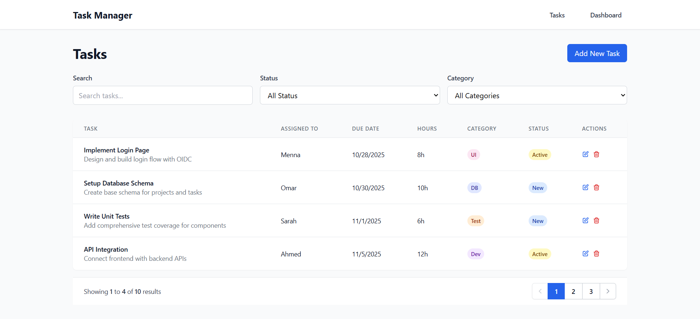
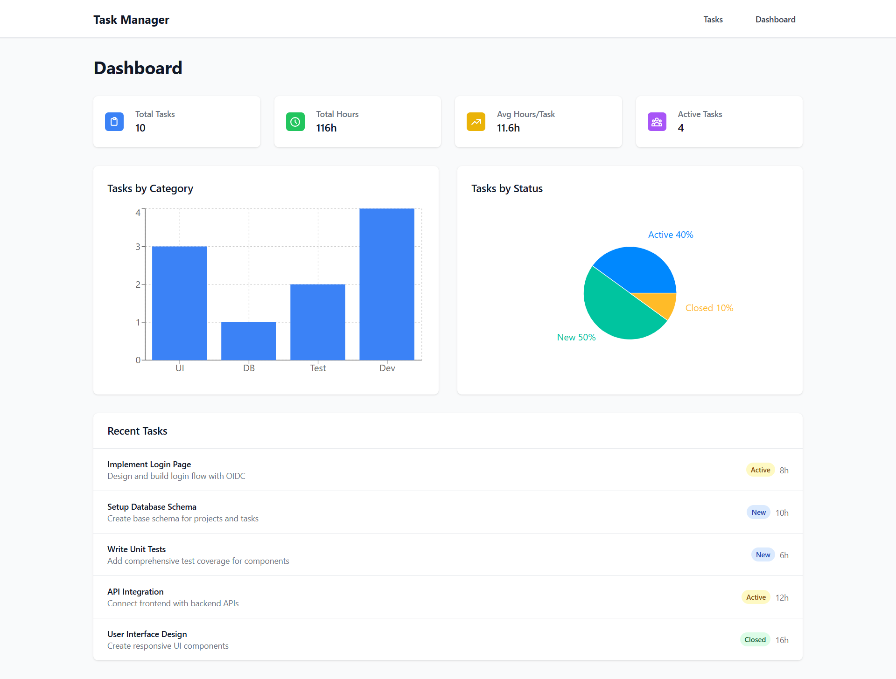
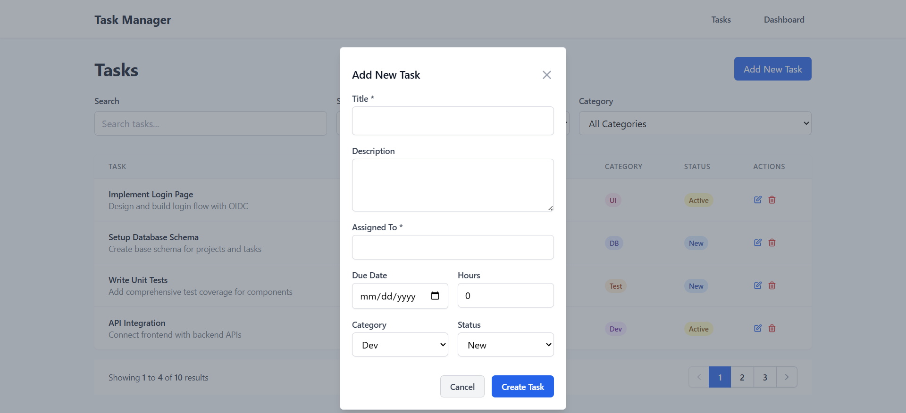

# Task Manager App

A comprehensive React application built with React 19, TypeScript, Tailwind CSS, and Redux Toolkit for efficient task management with advanced features.

## 📸 Screenshots

### 🗂️ Tasks Page


_Main tasks page with search, filtering, and task management functionality._

---

### 📊 Dashboard


_Analytics dashboard with charts, metrics, and recent tasks overview._

---

### ➕ Add New Task Modal


_Clean modal interface for creating and editing tasks._

## 🚀 Features

- **Full CRUD Operations**: Create, read, update, and delete tasks
- **Advanced Task Management**: Tasks with categories (Dev, Test, UI, DB), status (New, Active, Closed), and assignments
- **Interactive Dashboard**: Charts and statistics with Recharts
- **Smart Filtering**: Filter by status, category, and search functionality
- **Modal Forms**: Clean modal interfaces for task creation and editing
- **Toast Notifications**: User feedback with react-hot-toast
- **Responsive Design**: Mobile-first design with Tailwind CSS
- **State Management**: Redux Toolkit for predictable state management
- **Routing**: React Router v7 for navigation
- **Testing**: Unit tests with Vitest and Testing Library

## 🛠️ Tech Stack

- **React 19** - Latest stable version with TypeScript
- **Vite** - Fast build tool and development server
- **Tailwind CSS** - Utility-first CSS framework
- **Redux Toolkit** - Modern Redux with less boilerplate
- **React Router v7** - Client-side routing
- **Recharts** - Chart library for dashboard
- **React Hot Toast** - Toast notifications
- **Vitest** - Unit testing framework
- **TypeScript** - Type-safe JavaScript

## 📁 Project Structure

```
src/
├── components/          # Reusable UI components
│   ├── TaskTable.tsx   # Task table with CRUD operations
│   ├── TaskModal.tsx    # Modal for creating/editing tasks
│   ├── TaskItem.tsx     # Individual task item component
│   ├── Pagination.tsx   # Pagination component
│   └── __tests__/       # Component tests
│       ├── TaskTable.test.tsx
│       ├── TaskModal.test.tsx
│       ├── TaskItem.test.tsx
│       └── Pagination.test.tsx
├── pages/              # Page components
│   ├── TasksPage.tsx   # Tasks CRUD page
│   ├── DashboardPage.tsx # Dashboard with charts
│   └── TaskManager.tsx  # Main task manager page
├── data/               # Mock data and types
│   └── mockData.ts     # Task interface and sample data
├── store/              # Redux store configuration
│   ├── index.ts        # Store setup and typed hooks
│   └── slices/         # Redux slices
│       └── taskSlice.ts # Task state management
├── test/               # Test configuration
│   └── setup.ts        # Test setup file
├── hooks/              # Custom React hooks (empty)
├── services/           # API services (empty)
├── types/              # TypeScript type definitions (empty)
├── utils/              # Utility functions (empty)
├── assets/             # Static assets
│   └── react.svg       # React logo
├── App.tsx             # Main app component with routing
├── App.css             # Global app styles
├── index.css           # Base styles and Tailwind imports
└── main.tsx            # App entry point
```

## 🚀 Getting Started

### Prerequisites

- Node.js (v20.19+ or v22.12+)
- Yarn package manager

**Note:** If you're using an older Node.js version, you can use [Volta](https://volta.sh/) to manage Node.js versions:

```bash
volta install node@20
```

### Installation

1. Clone the repository:

```bash
git clone <repository-url>
cd task-manager-app
```

2. Install dependencies:

```bash
yarn install
```

3. Start the development server:

```bash
yarn dev
```

4. Open your browser and navigate to `http://localhost:5173`

### Available Scripts

- `yarn dev` - Start development server
- `yarn build` - Build for production
- `yarn preview` - Preview production build
- `yarn lint` - Run ESLint
- `yarn test` - Run tests in watch mode
- `yarn test:run` - Run tests once
- `yarn test:ui` - Run tests with UI

## 🎨 Features Overview

### Task Management

- **CRUD Operations**: Create, read, update, and delete tasks
- **Task Categories**: Dev, Test, UI, DB with color coding
- **Task Status**: New, Active, Closed with status indicators
- **Assignment**: Assign tasks to team members
- **Time Tracking**: Estimated hours for each task
- **Due Dates**: Set and track task deadlines

### Dashboard & Analytics

- **Statistics Cards**: Total tasks, hours, averages
- **Category Charts**: Bar charts showing task distribution
- **Status Charts**: Pie charts for status breakdown
- **Recent Tasks**: Quick overview of latest tasks

### Filtering & Search

- **Multi-Filter**: Filter by status, category, and search
- **Real-time Search**: Search across title, description, and assignee
- **Smart Filtering**: Combine multiple filters for precise results

### User Experience

- **Modal Forms**: Clean interfaces for task creation/editing
- **Toast Notifications**: Success/error feedback
- **Responsive Design**: Mobile-first approach
- **Accessibility**: ARIA roles and keyboard navigation

## 🔧 Redux Store Structure

```typescript
interface Task {
  id: number;
  title: string;
  description: string;
  assignedTo: string;
  dueDate: string;
  estimatedHours: number;
  category: "Dev" | "Test" | "UI" | "DB";
  status: "New" | "Active" | "Closed";
}

interface TaskState {
  tasks: Task[];
  filter: "all" | "New" | "Active" | "Closed";
  searchQuery: string;
  selectedCategory: "all" | "Dev" | "Test" | "UI" | "DB";
}
```

## 🎯 Key Components

### TaskForm

- Form for creating new tasks
- Input validation
- Priority selection
- Responsive design

### TaskItem

- Individual task display
- Toggle completion status
- Priority indicators
- Delete functionality

### TaskManager

- Main application page
- Task filtering and search
- Statistics display
- Bulk operations

## 🚀 Deployment

The app is ready for deployment to any static hosting service. Here are the recommended deployment options:

### Option 1: Vercel (Recommended)

1. **Push your code to GitHub**
2. **Go to [vercel.com](https://vercel.com)** and sign up with GitHub
3. **Import your repository** - Vercel will automatically detect it's a Vite React app
4. **Deploy!** - Your app will be live with a custom URL

**Advantages:**

- ✅ Zero configuration needed
- ✅ Automatic deployments on git push
- ✅ Custom domain support
- ✅ Free tier available

### Option 2: Netlify

1. **Push your code to GitHub**
2. **Go to [netlify.com](https://netlify.com)** and sign up
3. **Connect your GitHub repository**
4. **Build settings:**
   - Build command: `yarn build`
   - Publish directory: `dist`
5. **Deploy!**

### Option 3: GitHub Pages

1. **Enable GitHub Pages** in your repository settings
2. **The GitHub Actions workflow** (`.github/workflows/deploy.yml`) will automatically deploy your app
3. **Your app will be available at:** `https://yourusername.github.io/task-manager-app`

### Manual Deployment

If you prefer to deploy manually:

1. **Build the project:**

```bash
yarn build
```

2. **Deploy the `dist` folder** to any static hosting service (Vercel, Netlify, GitHub Pages, etc.)

## 📝 License

This project is open source and available under the [MIT License](LICENSE).

## 🤝 Contributing

Contributions are welcome! Please feel free to submit a Pull Request.
